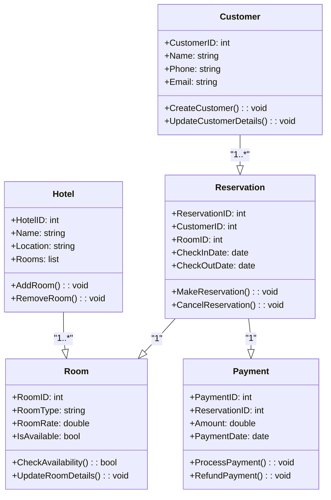
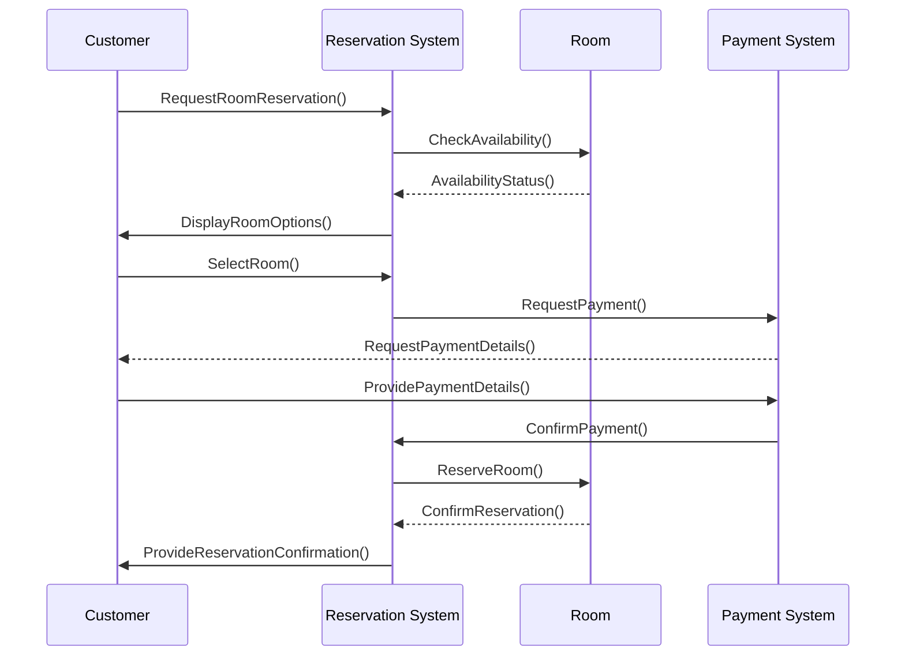

# test3

### 너는 시스템 설계 및 아키텍처 전문가야. 호텔 예약 시스템을 설계하고 mermaid UML 다이어그램을 작성해줘

```mermaid

classDiagram
    class Customer {
        +CustomerID: int
        +Name: string
        +Phone: string
        +Email: string
        +CreateCustomer(): void
        +UpdateCustomerDetails(): void
    }
    
    class Reservation {
        +ReservationID: int
        +CustomerID: int
        +RoomID: int
        +CheckInDate: date
        +CheckOutDate: date
        +MakeReservation(): void
        +CancelReservation(): void
    }
    
    class Room {
        +RoomID: int
        +RoomType: string
        +RoomRate: double
        +IsAvailable: bool
        +CheckAvailability(): bool
        +UpdateRoomDetails(): void
    }
    
    class Hotel {
        +HotelID: int
        +Name: string
        +Location: string
        +Rooms: list
        +AddRoom(): void
        +RemoveRoom(): void
    }
    
    class Payment {
        +PaymentID: int
        +ReservationID: int
        +Amount: double
        +PaymentDate: date
        +ProcessPayment(): void
        +RefundPayment(): void
    }

    Customer --|> Reservation: "1..*"
    Reservation --|> Room: "1"
    Reservation --|> Payment: "1"
    Hotel --|> Room: "1..*"

```
### 시퀀스 다이어그램도 작성해줘

```mermaid
sequenceDiagram
    participant Customer as Customer
    participant ReservationSystem as Reservation System
    participant Room as Room
    participant PaymentSystem as Payment System
    
    Customer->>ReservationSystem: RequestRoomReservation()
    ReservationSystem->>Room: CheckAvailability()
    Room-->>ReservationSystem: AvailabilityStatus()
    ReservationSystem->>Customer: DisplayRoomOptions()
    Customer->>ReservationSystem: SelectRoom()
    ReservationSystem->>PaymentSystem: RequestPayment()
    PaymentSystem-->>Customer: RequestPaymentDetails()
    Customer->>PaymentSystem: ProvidePaymentDetails()
    PaymentSystem->>ReservationSystem: ConfirmPayment()
    ReservationSystem->>Room: ReserveRoom()
    Room-->>ReservationSystem: ConfirmReservation()
    ReservationSystem->>Customer: ProvideReservationConfirmation()
```
